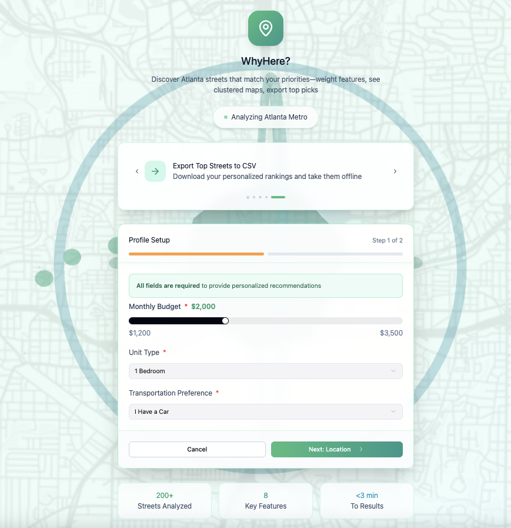
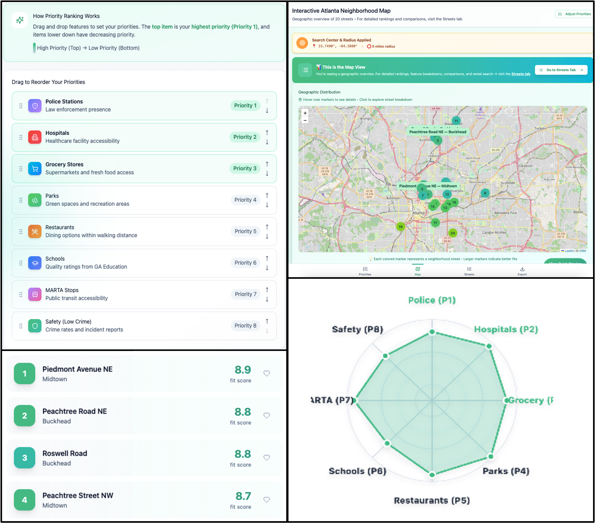
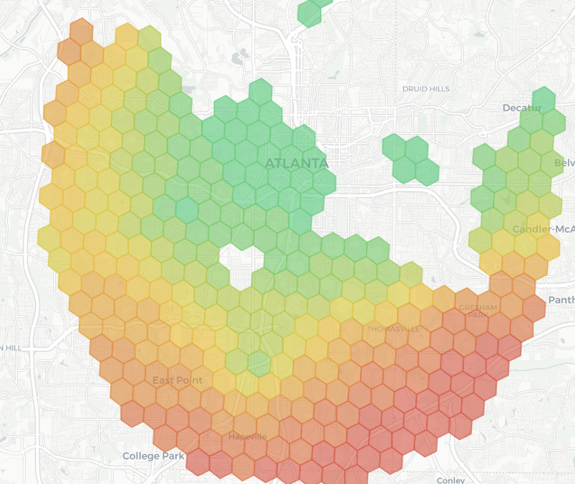

# WhyHere?: Explainable Neighborhood Recommendations for Atlanta

**WhyHere?** is an end-to-end, explainable neighborhood recommendation system that helps users identify suitable areas in Atlanta based on personalized priorities such as safety, transit access, rent affordability, and proximity to daily amenities.

**Why it matters?**: Choosing where to live is one of the biggest financial and personal decisions people make, yet most choices are based on scattered websites, hidden scores, and guesswork and what matters most when choosing a place to live is not the same for everyone. WhyHere? respects individual needs by letting each user define their own version of a “good neighborhood.” This makes the search fairer, more personal, and far more meaningful.

<p align="center">
  
</p>

**Live Demo:** https://why-here-tool.vercel.app/


## Key Features

- **Customizable preferences:** Users can assign importance to 8 urban features like parks, grocery store, public transport etc.
- **Interactive map:** Neighborhoods visualized with suitability scores  
- **Explainable results:** Each recommendation shows why it ranked high 
- **Collaborative filtering:** Suggests neighborhoods liked by users with similar preferences  

<p align="center">
  
</p> 


## Tech Stack & Algorithms Used

### 1. Machine Learning & Algorithms
- Multi-objective weighted scoring for neighborhood suitability ranking
- Percentile-based classification for interpretable ranking buckets
- DBSCAN clustering (experimented for spatial density analysis; rejected due to low interpretability)
- KNN-based collaborative filtering using user preference vectors

### 2. Data Preprocessing & Geospatial Processing
- Databricks + Apache Spark for data cleaning and preprocessing
- H3 geospatial indexing to divide Atlanta into uniform hexagonal grids
- KNN-based data imputation for missing rent and amenity values
- Feature normalization and distance-decay transformations

### 3. Frontend
- React, Vite, Mapbox

### 4. Backend
- Python Flask

### 5. Deployment
- Vercel


## Technical Overview

### 1. Data Pipeline

18.7M raw records filtered down to ~60k Atlanta POIs for scoring. All ingestion, filtering, and GeoJSON to lat/lon processing ran on Databricks Spark for scalable, reproducible preprocessing.

### 2. Spatial Modeling

- Atlanta is discretized into H3 hexagons to ensure uniform spatial comparison, consistent neighborhood-level analytics and aggregation of POI (point of interest) data
- Each POI is mapped to nearby hexagons using distance-based decay functions i.e. further away a POI is lesser its impact on score
- Missing rent data is imputed using **K-Nearest Neighbors (KNN)** based on spatial and feature similarity
- All features are normalized to allow meaningful weighted aggregation

### 3.  Suitability Scoring (Multi-Objective Ranking)

- Each hexagon’s final score is computed as a weighted sum of normalized feature values
- The scoring approach was evaluated using **DBSCAN-based clustering** and **percentile-based classification**; percentile-based grouping was selected as it produced more **interpretable clusters** and **intuitively meaningful separations** across urban features

<p align="center">
  
</p> 

### 4.  Explainability and Recommendations

- For every recommended area, the system exposes individual feature contributions, making the system user-trustworthy
- User preference vectors are stored locally and a **KNN-based similarity model** is used to identify users with comparable priorities and recommend neighborhoods favored by similar users


## Installation Guide

### 1. Clone the Repository

Start by cloning the repository to your local machine:

```bash
git clone  https://github.com/utkarsh-mhw/WhyHereTool.git
cd <location_of_the_folder>
```

### 2. Running the Frontend

The frontend is built in React and uses Mapbox/Leaflet for interactive mapping.

#### a. Install Dependencies:

```bash
npm install
```

(Note: If package.json is located inside a frontend folder, you may need to navigate there first or use the prefix command).

#### b. Start the Frontend:

```bash
npm run dev --prefix frontend
```

### 3. Running the Backend

The backend is a Python Flask service that exposes endpoints for feature scoring, ranking, and explanation generation.

#### a. Install Python Dependencies:

Run this command from the root directory:

```bash
pip3 install -r requirements.txt
```

#### b. Start the Server:

```bash
python3 app.py
```

The server will start at:

```cpp
http://127.0.0.1:5000/
```


## Disclaimer

- All datasets used in this project are sourced from publicly available government and open-data portals.
- The tool is intended for analytical and exploratory purposes only and should not be interpreted as real estate, legal, or policy advice.
- Neighborhood scores reflect modeled estimates based on selected features and user-defined preferences, not absolute measures of quality.


## Contact / Questions

For any questions, feedback, or collaboration opportunities, feel free to reach out:

- **Email:** utkarshm005@gmail.com/ umaheshwari8@gatech.edu
- **LinkedIn:** [www.linkedin.com/in/utkarshmah](www.linkedin.com/in/utkarshmah)  